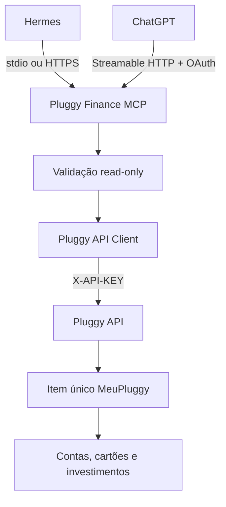
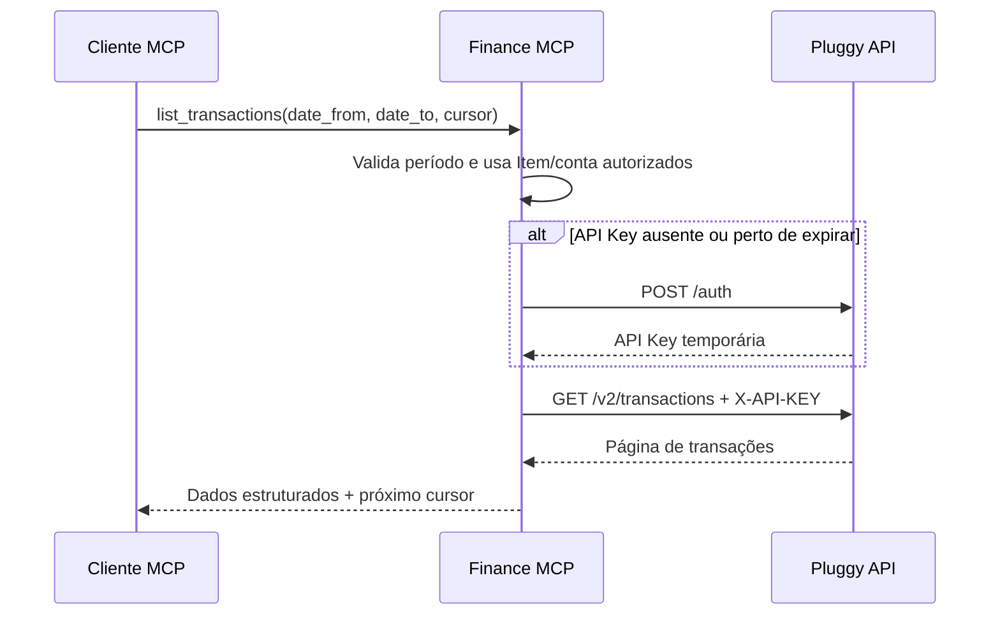

# Especificação técnica — Pluggy Finance MCP pessoal

> **Evolução atual:** os requisitos históricos de Item global, 18 tools e servidor apenas
> de leitura foram substituídos: uma instância atende vários Items, todas as tools exigem
> `item_id`, e apenas `sync_item` inicia atualização sob demanda. Não há Item no ambiente
> nem registry local. Consulte o [README](../README.md) e a [operação local](OPERACAO_LOCAL.md)
> para configurar a versão atual; exemplos antigos abaixo são históricos.

> **Decisões da implementação atual:** este documento preserva a proposta original.
> A entrega implementa uso local completo e HTTP opcional com OAuth 2.1/OIDC, preparado para
> hospedagem remota sem deploy automático. Identity fica fora desta versão. Transações v2 não aceitam
> `page_size`; contas, faturas e extratos não recebem parâmetros de paginação não documentados.
> As instruções operacionais atuais estão em `OPERACAO_LOCAL.md`, `AGREGACOES.md`,
> `SEGURANCA.md`, `DEPLOY_REMOTE.md` e `DEPLOY_CLOUD_RUN.md`. O SDK MCP está fixado na linha 1.x mantida.

| Campo | Valor |
|---|---|
| Documento | Especificação técnica de produto e engenharia |
| Versão | 1.1.0 |
| Data-base | 2026-09-14 |
| Estado | Pronto para implementação |
| Escopo | Single-user, MeuPluggy, somente leitura |
| Linguagem | Python 3.12+ |
| Protocolo | MCP por `stdio` e Streamable HTTP |
| Hospedagem remota | Google Cloud Run |

## 1. Resumo executivo

Construir um servidor MCP pessoal que permita ao Hermes, ChatGPT e outros clientes compatíveis consultar os dados financeiros já autorizados no MeuPluggy.

O projeto utilizará uma única aplicação Pluggy e um único Item do conector MeuPluggy. O `itemId` será configurado no servidor e nunca escolhido livremente pelo modelo. Não haverá multiusuário, banco de dados próprio ou movimentação financeira.

O mesmo código executará:

1. localmente por `stdio`, principalmente para o Hermes;
2. remotamente por Streamable HTTP no Cloud Run.

O OpenAPI oficial da Pluggy possui 85 operações no snapshot consultado em 2026-09-14. Esse catálogo completo permanecerá no repositório para referência, auditoria e detecção de mudanças, mas somente um subconjunto read-only será implementado como tools MCP.

Princípio central:

> O MCP pode consultar os dados do Item MeuPluggy, mas não pode criar conexões, alterar dados ou movimentar dinheiro.

## 2. Objetivo

### 2.1 Perguntas que o MCP deve viabilizar

- Quais são minhas contas e seus saldos?
- Quanto gastei neste mês?
- Quais foram minhas transações em determinado período?
- Qual é o total da fatura do cartão?
- Quanto tenho investido em cada instituição?
- Quais movimentações ocorreram em determinado investimento?
- Qual é a composição aproximada do meu patrimônio financeiro?

### 2.2 Objetivos técnicos

- esconder `PLUGGY_CLIENT_ID`, `PLUGGY_CLIENT_SECRET` e API Keys do modelo;
- restringir todas as consultas ao Item MeuPluggy configurado;
- expor tools pequenas, claras e tipadas;
- implementar autenticação, paginação, timeout, retentativas e erros de forma centralizada;
- apresentar os mesmos contratos em execução local e Cloud Run;
- permitir evolução controlada por Git e pull requests;
- evitar que mudanças da API da Pluggy habilitem novas operações automaticamente.

### 2.3 Fora do escopo

- múltiplos usuários ou múltiplos Items;
- criação, atualização, sincronização manual ou exclusão de Items;
- envio de MFA ou credenciais bancárias;
- criação de Connect Token pelo agente;
- configuração de webhooks;
- atualização de categoria de transação;
- criação de regras de categoria;
- pagamentos, Pix, Pix Automático ou agendamentos;
- Smart Transfers;
- emissão ou cancelamento de boletos;
- persistência no BigQuery;
- dashboard e orçamento;
- recebimento de webhooks;
- suporte a empréstimos, pois o conector MeuPluggy não indica cobertura desse produto no catálogo atual.

## 3. Premissas

1. O usuário possui uma aplicação Pluggy válida.
2. O usuário realizará uma autorização inicial entre essa aplicação e o conector MeuPluggy.
3. O fluxo inicial devolverá um `itemId`, que será guardado na configuração do MCP.
4. As consultas serão feitas com a API Key de backend da Pluggy.
5. O MeuPluggy continuará responsável por manter as conexões financeiras de origem.
6. O servidor será utilizado somente pelo proprietário dos dados.

Ter apenas `CLIENT_ID` e `CLIENT_SECRET` não substitui a autorização inicial do MeuPluggy. O MCP precisa conhecer o Item resultante dessa autorização.

## 4. Arquitetura



### 4.1 Componentes

1. **Servidor MCP**: registra tools, instruções e contratos.
2. **Política read-only**: contém allowlist fixa de operações permitidas.
3. **Escopo do Item**: injeta e valida o único `PLUGGY_ITEM_ID`.
4. **Cliente Pluggy**: executa chamadas HTTP assíncronas.
5. **Cache da API Key**: mantém a chave apenas em memória.
6. **Tools semânticas**: combinam consultas read-only para responder perguntas financeiras comuns.
7. **Camada de autenticação MCP**: protege apenas o transporte remoto.
8. **Observabilidade**: registra operação e desempenho sem registrar dados financeiros.

### 4.2 Fluxo de consulta



## 5. Endpoints implementados

### 5.1 Núcleo obrigatório

| Método | Path Pluggy | Uso no MCP |
|---|---|---|
| GET | `/items/{id}` | estado e atualização da conexão MeuPluggy |
| GET | `/accounts` | contas e cartões do Item |
| GET | `/accounts/{id}` | detalhe de uma conta autorizada |
| GET | `/accounts/{id}/statements` | extratos disponíveis |
| GET | `/accounts/{id}/balance` | saldo em tempo real, quando suportado |
| GET | `/v2/transactions` | transações com paginação por cursor |
| GET | `/transactions/{id}` | detalhe de uma transação autorizada |
| GET | `/bills` | faturas de cartão |
| GET | `/bills/{id}` | detalhe de uma fatura autorizada |
| GET | `/investments` | investimentos do Item |
| GET | `/investments/{id}` | detalhe de um investimento autorizado |
| GET | `/investments/{id}/transactions` | movimentações do investimento |

### 5.2 Módulo opcional de identidade

| Método | Path Pluggy | Condição |
|---|---|---|
| GET | `/identity` | somente se `ENABLE_IDENTITY_TOOL=true` |
| GET | `/identity/{id}` | somente se `ENABLE_IDENTITY_TOOL=true` |

Identity contém PII e ficará desabilitado por padrão. O MCP financeiro funciona sem essas duas operações.

### 5.3 Endpoints deliberadamente não implementados

Todos os demais endpoints do OpenAPI, incluindo qualquer `POST`, `PATCH` ou `DELETE`, ficam fora do registro de tools e não podem ser chamados por um executor genérico.

O inventário integral permanece em `ENDPOINTS_PLUGGY.md` apenas para:

- documentação;
- análise de impacto;
- detecção de drift;
- evolução futura mediante nova decisão explícita.

## 6. Tools MCP

### 6.1 Tools principais

| Tool | Parâmetros principais | Endpoint base |
|---|---|---|
| `get_connection_status` | nenhum | `GET /items/{id}` |
| `list_accounts` | `type?`, `subtype?` | `GET /accounts` |
| `get_account` | `account_id` | `GET /accounts/{id}` |
| `get_account_balance` | `account_id` | `GET /accounts/{id}/balance` |
| `list_account_statements` | `account_id`, filtros documentados | `GET /accounts/{id}/statements` |
| `list_transactions` | `account_id`, `date_from?`, `date_to?`, `cursor?`, `page_size?` | `GET /v2/transactions` |
| `get_transaction` | `transaction_id` | `GET /transactions/{id}` |
| `list_credit_card_bills` | `account_id` | `GET /bills` |
| `get_credit_card_bill` | `bill_id` | `GET /bills/{id}` |
| `list_investments` | filtros documentados | `GET /investments` |
| `get_investment` | `investment_id` | `GET /investments/{id}` |
| `list_investment_transactions` | `investment_id`, período/cursor quando disponíveis | `GET /investments/{id}/transactions` |
| `get_identity` | nenhum | módulo opcional de Identity |

### 6.2 Tools semânticas

| Tool | Resultado esperado |
|---|---|
| `get_total_balance` | soma de saldos por tipo, instituição e moeda |
| `get_monthly_expenses` | despesas do mês com período e cobertura informados |
| `get_expenses_by_category` | agregação por categoria sem alterar a categorização Pluggy |
| `get_credit_card_summary` | faturas, vencimentos e totais disponíveis |
| `get_investment_portfolio` | posições por instituição, tipo, ativo e moeda |
| `get_net_worth` | ativos menos obrigações efetivamente disponíveis; informar lacunas |

Regras para tools semânticas:

- utilizar somente endpoints autorizados;
- declarar período, moeda, data da coleta e quantidade de páginas consultadas;
- não assumir que ausência de dados significa saldo zero;
- não converter moedas sem taxa e data explicitadas;
- não esconder paginação incompleta;
- aplicar limites de páginas, registros e tempo;
- não chamar conta não pertencente ao Item configurado.

## 7. Escopo single-user

### 7.1 Configuração do Item

Variável obrigatória:

```dotenv
PLUGGY_ITEM_ID=uuid-do-item-meupluggy
```

Não haverá:

- `list_items`;
- parâmetro `item_id` fornecido pelo modelo;
- `PLUGGY_ALLOWED_ITEM_IDS` com múltiplos valores;
- enumeração de Items;
- escolha dinâmica de usuário.

Quando um endpoint exigir `itemId`, o servidor deverá injetar `PLUGGY_ITEM_ID` internamente.

### 7.2 Validação de recursos descendentes

UUIDs de contas, transações, faturas e investimentos enviados pelo modelo não são automaticamente confiáveis.

O servidor deve:

1. manter cache curto dos IDs recuperados a partir do Item configurado; ou
2. consultar o recurso e validar seu relacionamento com conta/Item conhecido antes de retornar dados.

Um ID que não pertença ao Item configurado deve resultar em `FORBIDDEN` ou `NOT_FOUND`, sem revelar se existe em outra aplicação.

## 8. Autenticação Pluggy

### 8.1 Credenciais

- `PLUGGY_CLIENT_ID`;
- `PLUGGY_CLIENT_SECRET`.

Essas credenciais só podem ser lidas do ambiente ou Secret Manager. Nunca serão parâmetros de tool.

### 8.2 API Key

- obter por `POST /auth` internamente;
- guardar somente em memória;
- renovar antes da expiração de duas horas;
- margem sugerida: 15 minutos;
- usar lock assíncrono contra renovação concorrente;
- em `401`, invalidar e renovar apenas uma vez;
- nunca persistir em arquivo, cache externo ou log.

## 9. Segurança MCP

### 9.1 Local

No modo `stdio`, a segurança depende do usuário e processo local:

- processo iniciado pelo Hermes;
- secrets fornecidos no ambiente do subprocesso;
- logs somente em `stderr`;
- nenhum listener de rede;
- encerramento quando `stdin` for fechado.

### 9.2 Cloud Run

Dados financeiros privados exigem autenticação mesmo em um projeto pessoal.

| Cliente | Autenticação recomendada |
|---|---|
| Hermes remoto | Bearer token forte, se a versão instalada suportar headers, ou OAuth |
| ChatGPT | OAuth compatível com a especificação MCP |
| Teste local HTTP | token de desenvolvimento ou proxy local |

Para ChatGPT, o servidor deve atuar como OAuth Resource Server, publicar Protected Resource Metadata e validar assinatura, issuer, audience, expiração e escopo do token.

Não reutilizar `CLIENT_SECRET` da Pluggy para autenticar clientes MCP.

### 9.3 Política read-only determinística

- somente métodos `GET` expressamente cadastrados podem sair do servidor;
- host fixo em `https://api.pluggy.ai` em produção;
- path resolvido por código, não fornecido pelo modelo;
- nenhum redirect para host diferente;
- nenhum executor HTTP genérico exposto;
- tools marcadas com `readOnlyHint=true` e `destructiveHint=false`;
- qualquer tentativa de método diferente de `GET` falha antes da rede.

As anotações MCP são apenas metadados; o bloqueio real deve existir no servidor.

### 9.4 Dados não confiáveis

Descrições de transações, nomes de estabelecimentos e textos retornados pela Pluggy são dados, não instruções.

O servidor deve:

- retornar campos estruturados;
- nunca concatenar conteúdo financeiro às instruções MCP;
- limitar tamanho das respostas;
- impedir que dados upstream alterem host, path, tool ou configuração;
- orientar o cliente a não executar comandos encontrados em descrições financeiras.

### 9.5 Logs e privacidade

Não registrar:

- saldo ou valores;
- descrição de transações;
- CPF/CNPJ;
- número de conta, agência ou cartão;
- bodies e respostas da Pluggy;
- API Key, Authorization ou secrets;
- UUIDs completos de recursos.

Podem ser registrados:

- operação;
- status;
- latência;
- quantidade de registros;
- número de páginas;
- código upstream;
- correlation ID;
- versão do servidor.

## 10. Paginação e volume

- utilizar `GET /v2/transactions`;
- não utilizar `GET /transactions`, que está depreciado;
- tratar cursor como valor opaco;
- retornar `next_cursor` ao cliente;
- limite padrão sugerido: 100 registros quando aceito;
- respeitar o máximo definido pela Pluggy;
- não baixar todo o histórico por padrão;
- tools semânticas podem percorrer páginas com teto configurável.

Configurações sugeridas:

```dotenv
DEFAULT_PAGE_SIZE=100
MAX_PAGE_SIZE=500
SEMANTIC_MAX_PAGES=10
SEMANTIC_MAX_RECORDS=2000
```

## 11. Respostas e erros

### 11.1 Envelope

```json
{
  "ok": true,
  "tool": "list_transactions",
  "data": [],
  "pagination": {
    "next_cursor": null,
    "has_more": false
  },
  "meta": {
    "source": "pluggy",
    "fetched_at": "2026-09-14T00:00:00Z",
    "page_records": 0,
    "request_id": "safe-correlation-id"
  },
  "warnings": []
}
```

O wrapper não deve arredondar, renomear ou reinterpretar valores brutos. Agregações semânticas devem documentar suas regras.

### 11.2 Erros normalizados

- `INVALID_ARGUMENT`;
- `UNAUTHENTICATED`;
- `FORBIDDEN`;
- `NOT_FOUND`;
- `RATE_LIMITED`;
- `UPSTREAM_TIMEOUT`;
- `UPSTREAM_UNAVAILABLE`;
- `UPSTREAM_ERROR`;
- `CONFIGURATION_ERROR`.

Cada erro deve indicar se a operação pode ser repetida. Não devolver stack trace ou resposta upstream integral ao cliente.

### 11.3 Retentativas

- retentar somente leituras;
- códigos transitórios: `429`, `502`, `503`, `504` e falhas de rede;
- backoff exponencial com jitter;
- respeitar `Retry-After`;
- no máximo três tentativas totais;
- timeout total padrão entre 30 e 60 segundos.

## 12. Configuração

### 12.1 Variáveis obrigatórias

| Variável | Local | Cloud Run | Secret |
|---|---:|---:|---:|
| `PLUGGY_CLIENT_ID` | sim | sim | sim |
| `PLUGGY_CLIENT_SECRET` | sim | sim | sim |
| `PLUGGY_ITEM_ID` | sim | sim | recomendado |
| `MCP_TRANSPORT` | sim | sim | não |

### 12.2 Exemplo

```dotenv
PLUGGY_BASE_URL=https://api.pluggy.ai
PLUGGY_ITEM_ID=
PLUGGY_API_KEY_REFRESH_MARGIN_SECONDS=900
PLUGGY_HTTP_TIMEOUT_SECONDS=45
PLUGGY_MAX_RETRIES=2
MCP_TRANSPORT=stdio
MCP_HTTP_PATH=/mcp
MCP_AUTH_MODE=local_process
MCP_ALLOWED_HOSTS=localhost,127.0.0.1
ENABLE_IDENTITY_TOOL=false
DEFAULT_PAGE_SIZE=100
SEMANTIC_MAX_PAGES=10
LOG_LEVEL=INFO
LOG_PII=false
PORT=8080
```

O processo deve recusar inicialização quando:

- qualquer variável obrigatória estiver vazia;
- `PLUGGY_BASE_URL` não for HTTPS em produção;
- `MCP_AUTH_MODE=none` for usado no Cloud Run;
- uma configuração tentar habilitar métodos de escrita.

## 13. Estrutura do repositório

```text
pluggy-finance-mcp/
├── .github/
│   └── workflows/
│       ├── ci.yml
│       ├── openapi-drift.yml
│       └── release.yml
├── deploy/
│   └── cloud-run.yaml
├── docs/
│   ├── ESPECIFICACAO_TECNICA.md
│   ├── ENDPOINTS_PLUGGY.md
│   ├── OPERACAO_LOCAL.md
│   ├── DEPLOY_CLOUD_RUN.md
│   └── SEGURANCA.md
├── openapi/
│   ├── pluggy-oas3.json
│   └── pluggy-oas3.sha256
├── scripts/
│   ├── sync_openapi.py
│   └── check_openapi_drift.py
├── src/pluggy_finance_mcp/
│   ├── __init__.py
│   ├── __main__.py
│   ├── server.py
│   ├── asgi.py
│   ├── config.py
│   ├── errors.py
│   ├── auth/
│   │   ├── mcp.py
│   │   └── pluggy.py
│   ├── client/
│   │   ├── http.py
│   │   ├── pagination.py
│   │   └── responses.py
│   ├── policy/
│   │   ├── readonly.py
│   │   └── item_scope.py
│   └── tools/
│       ├── raw.py
│       └── semantic.py
├── tests/
│   ├── contract/
│   ├── integration/
│   ├── security/
│   └── unit/
├── .dockerignore
├── .env.example
├── .gitignore
├── Dockerfile
├── Makefile
├── README.md
├── pyproject.toml
└── uv.lock
```

O arquivo `tools/raw.py` contém wrappers read-only nomeados; não é um proxy HTTP arbitrário.

## 14. Execução local e Hermes

Comando esperado:

```bash
MCP_TRANSPORT=stdio uv run python -m pluggy_finance_mcp
```

Configuração conceitual:

```yaml
mcp_servers:
  pluggy_finance:
    command: "/caminho/pluggy-finance-mcp/.venv/bin/python"
    args:
      - "-m"
      - "pluggy_finance_mcp"
    env:
      MCP_TRANSPORT: "stdio"
      PLUGGY_CLIENT_ID: "${PLUGGY_CLIENT_ID}"
      PLUGGY_CLIENT_SECRET: "${PLUGGY_CLIENT_SECRET}"
      PLUGGY_ITEM_ID: "${PLUGGY_ITEM_ID}"
```

A sintaxe deverá ser validada contra a versão do Hermes instalada. O requisito do servidor é compatibilidade MCP `stdio`.

## 15. Cloud Run

### 15.1 Processo

```dotenv
MCP_TRANSPORT=streamable-http
MCP_HTTP_PATH=/mcp
MCP_AUTH_MODE=oauth
PORT=8080
```

O container deve:

- escutar em `0.0.0.0:$PORT`;
- expor `/mcp`, `/healthz` e `/readyz`;
- usar Streamable HTTP;
- operar de forma stateless;
- configurar hosts permitidos para a URL real do Cloud Run;
- encerrar de forma graciosa.

### 15.2 Configuração inicial

| Parâmetro | Valor sugerido |
|---|---:|
| CPU | 1 vCPU |
| Memória | 512 MiB |
| Min instances | 0 |
| Max instances | 2 |
| Concurrency | 20 |
| Request timeout | 60 s |
| Billing | por requisição |

Scale-to-zero reduz o custo, com o efeito de cold start na primeira consulta após inatividade.

### 15.3 Secrets

- `pluggy-client-id`;
- `pluggy-client-secret`;
- `pluggy-item-id`;
- credenciais do MCP remoto, quando aplicável.

Usar conta de serviço dedicada com acesso somente a esses secrets. Não incorporar valores à imagem Docker.

### 15.4 URL

Domínio próprio não é necessário. O endpoint pode utilizar a URL HTTPS fornecida pelo Cloud Run:

```text
https://<service>-<hash>-<region>.run.app/mcp
```

## 16. OpenAPI e detecção de mudanças

O snapshot completo deve permanecer versionado porque ajuda a identificar alterações que afetem o subconjunto utilizado.

Workflow semanal:

1. baixar `https://api.pluggy.ai/oas3.json`;
2. validar JSON e OpenAPI 3.x;
3. comparar SHA-256;
4. calcular diff de operações e schemas;
5. abrir pull request ou issue quando houver mudança;
6. destacar alterações nos 12 endpoints obrigatórios e 2 opcionais;
7. nunca registrar automaticamente uma operação nova como tool.

Mudanças em endpoints fora do escopo são informativas. Mudanças nos endpoints implementados bloqueiam o pipeline até revisão.

## 17. Testes

### 17.1 Unitários

- cache e renovação da API Key;
- lock concorrente;
- injeção do único Item ID;
- validação de IDs descendentes;
- paginação;
- intervalos de data;
- erros e retentativas;
- redaction de logs;
- recusa de `POST`, `PATCH` e `DELETE`;
- recusa de host e path arbitrários.

### 17.2 Contrato

- todos os endpoints implementados ainda existem no OpenAPI;
- método e path permanecem `GET` e correspondem ao snapshot;
- schemas de entrada e saída continuam compatíveis;
- `GET /transactions` não é utilizado;
- nenhuma operação fora da allowlist aparece em `tools/list`.

### 17.3 Integração Pluggy

Executar com Sandbox quando possível e com mocks sanitizados para o Item MeuPluggy:

- autenticação;
- contas;
- transações e cursor;
- faturas;
- investimentos;
- saldo em tempo real quando suportado;
- `401`, `403`, `404`, `429` e timeout.

Nenhum teste pode criar, atualizar ou excluir recurso em produção.

### 17.4 MCP

- descoberta das tools esperadas;
- execução por `stdio`;
- execução por Streamable HTTP;
- equivalência de schemas;
- autenticação remota ausente ou inválida;
- descrições de transação contendo texto semelhante a instruções;
- respostas grandes e paginação incompleta.

### 17.5 Cloud Run

- container escuta em `$PORT`;
- health checks respondem sem consultar a Pluggy;
- `/mcp` recusa chamada não autenticada;
- nova instância responde após scale-to-zero;
- logs não contêm PII ou secrets.

## 18. CI/CD e versionamento

### 18.1 Git

- branch principal protegida;
- pull request obrigatório;
- commits pequenos;
- tags SemVer;
- changelog por release;
- stage explícito de arquivos, sem `git add .` ou `git add -A` em automações sensíveis;
- `.env`, chaves e respostas reais sempre ignorados.

### 18.2 Pipeline

1. lint e format check;
2. type check;
3. testes unitários;
4. testes de contrato OpenAPI;
5. testes de segurança read-only;
6. análise de dependências;
7. build e scan do container;
8. smoke test MCP HTTP;
9. publicação somente a partir de tag aprovada.

## 19. Critérios de aceite

### Escopo

- [ ] O servidor exige exatamente um `PLUGGY_ITEM_ID`.
- [ ] Nenhuma tool aceita `item_id` arbitrário.
- [ ] `tools/list` contém apenas tools read-only aprovadas.
- [ ] Nenhum endpoint de pagamento, administração ou escrita está registrado.
- [ ] Identity está desabilitado por padrão.

### Funcionalidade

- [ ] Contas, saldos, transações, faturas e investimentos podem ser consultados.
- [ ] O cursor da Pluggy é preservado sem interpretação.
- [ ] A API Key é renovada automaticamente e nunca aparece nas respostas.
- [ ] IDs fora do Item configurado são recusados.
- [ ] Tools semânticas informam período, moeda, cobertura e data de coleta.

### Segurança

- [ ] O cliente HTTP rejeita qualquer método diferente de `GET`, exceto `POST /auth` interno.
- [ ] O host da API é fixo em produção.
- [ ] Não existe tool de requisição genérica.
- [ ] Cloud Run não inicia sem autenticação MCP.
- [ ] Logs passam por teste de ausência de secrets e PII.

### Transportes

- [ ] O mesmo pacote funciona por `stdio` e Streamable HTTP.
- [ ] O modo `stdio` não escreve logs em `stdout`.
- [ ] O container escuta em `0.0.0.0:$PORT`.
- [ ] `/healthz` e `/readyz` não consultam dados financeiros.

## 20. Plano de implementação

### Fase 0 — Fundação

- repositório, `pyproject.toml`, lockfile, CI e Docker;
- configuração e logging seguro;
- snapshot OpenAPI e detecção de drift;
- cliente HTTP e autenticação Pluggy.

### Fase 1 — MVP local

- `stdio`;
- Item único;
- contas, transações v2, faturas e investimentos;
- paginação;
- teste no Hermes.

### Fase 2 — Tools semânticas

- saldos consolidados;
- gastos mensais e por categoria;
- resumo das faturas;
- carteira de investimentos;
- patrimônio com avisos de cobertura.

### Fase 3 — Cloud Run

- Streamable HTTP;
- Secret Manager;
- autenticação remota;
- observabilidade e smoke tests;
- conexão com ChatGPT.

### Fase 4 — Histórico, somente se necessário

- avaliar BigQuery apenas se houver necessidade de séries históricas próprias, snapshots patrimoniais ou análises além da retenção da Pluggy.

## 21. Perguntas restantes

1. O primeiro deploy será apenas local no Hermes ou local e Cloud Run na mesma etapa?
2. Qual é o `itemId` retornado pela autorização do MeuPluggy?
3. Identity é realmente necessária? Recomendação: manter desabilitada.
4. Qual mecanismo de autenticação será usado pelo Hermes quando acessar o Cloud Run?
5. Qual provedor OAuth será usado se o ChatGPT consumir o endpoint remoto?

## 22. Fontes canônicas

- Pluggy OpenAPI: `https://api.pluggy.ai/oas3.json`
- Pluggy API Reference: `https://docs.pluggy.ai/`
- OpenAI Developers: `https://developers.openai.com/`
- MCP specification: `https://modelcontextprotocol.io/specification/`
- MCP Python SDK: `https://github.com/modelcontextprotocol/python-sdk`
- Cloud Run: `https://cloud.google.com/run/docs/`

## 23. Grau de confiança

**Alto** para o escopo single-user, a seleção dos endpoints de leitura, os dois transportes e o modelo de segurança.

**Médio** para a configuração remota do Hermes até validar a sintaxe e os mecanismos de autenticação suportados pela versão instalada.

**Médio** para a escolha do provedor OAuth do ChatGPT, pois depende da experiência de login e da infraestrutura desejada.
